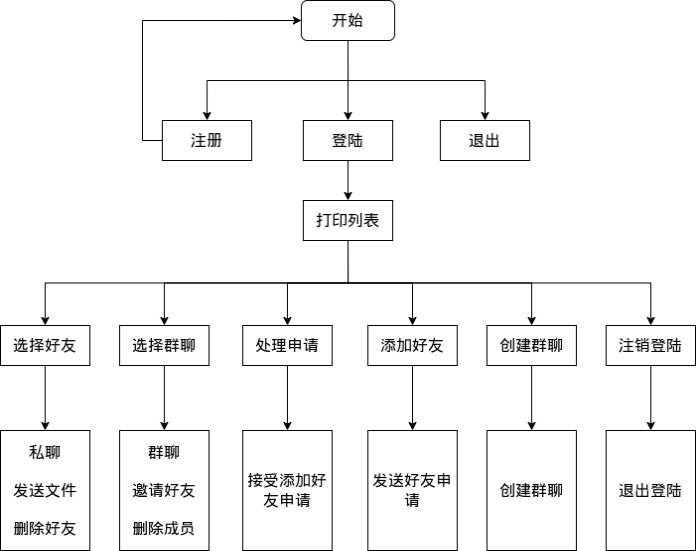

# 基于套接字编程接口的网络聊天协议


### 协议功能

- 用户管理功能（用户登陆、注册和登出）
- 好友管理功能（添加和删除好友、获取在线好友列表）
- 群组功能（创建、删除群组，邀请好友入群，删除群组成员）
- 聊天功能（好友私聊、群组群聊）
- 文件传输功能（好友之间传输文件）

功能框架如下：

 

### 协议系统架构
#### 服务器
- 服务层 (Server Service Layer)
  - 套接字管理：处理套接字连接和消息传输，监听客户端请求。
  - 消息路由：调用持续层合适的模块进行处理，并将结果返回给客户端。
  - 线程处理：接受客户端的连接后进行线程管理。
- 持续层 (Server Persistence Layer)
  - 数据操作：处理服务层传递过来的数据，对数据库或链表进行增删改查，最后返回结果。
  
#### 客户端
- 交互层 (Client View Layer)
  - 用户界面：显示和处理用户输入，向服务层传递交互信息。
- 服务层 (Client Service Layer)
  - 套接字管理：处理套接字连接和消息传输。
  - 消息路由：调用持续层合适的模块进行处理，并将数据发送至服务器处理。
  - 线程处理：接受服务器的连接后进行线程管理。

### 使用
1. 将./chat_room.sql导入mysql
2. 根据mysql配置更改./Server目录下的config.json
3. 分别编译Server和Client程序
   ```bash
	cd ./Client
	make
	cd ../Server
	make
   ```
4. 运行服务器和客户端
   ```bash
	./chat_room_svr
	./chat_room_cli
   ```


